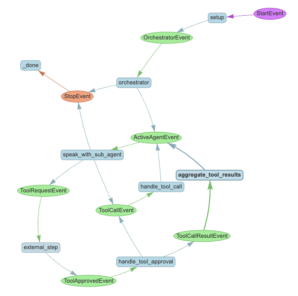

# Multi-agent system
This repo refers to [multi-agent-concierge](https://github.com/run-llama/multi-agent-concierge) to implement a multi-agent system with information agent and health coaching agent. The simplified flow chat is shown below:


## Setup
specify python3.12
```bash
poetry env use python3.12
```
install dependencies
```bash
poetry install
```

start service
```bash
poetry run python main.py
```

## What we built

We built a system of agents to complete the above flow chat. There are two basic "task" agents:
* A health information agent (which takes care of questions like "How to learn genai")
* A health coaching agent (which takes care of questions like "I want to start health coaching")

Currently, the health coaching flow is a bit fixed, we just use some mock function to demo the workflow.

## Repo Structure

- `main.py` - the main entry point for the application. Sets up the global state and the agent pool, and starts the workflow. See this for a detailed quickstart example of how to use the system.
- `workflow.py` - the workflow definition, including all the agents and tools. This handles orchestration, routing, and human approval.
- `utils.py` - additional utility functions for the workflow, mainly to provide the `FunctionToolWithContext` class.

## The system in action


To get a sense of how this works in practice, here's sample output during an interaction with the system.

At the beginning of the conversation, no active speaker is set, so you get routed to the concierge orchestration agent:

<blockquote>
<span style="color:blue">AGENT >>  Hello! How can I assist you today?</span>
<span style="color:white">USER >> I want to start health coaching</span>
<span style="color:green">SYSTEM >> Transferring to agent Health Coach Agent</span>
<span style="color:green">SYSTEM >> I need approval for the following tool call: get_user_information {} </span>
<span style="color:white">Do you approve? (y/n): y</span>
<span style="color:green">SYSTEM >> Retrieving user information</span>
<span style="color:green">SYSTEM >> Tool get_user_information called with {} returned The user information is {'age': 25, 'weight': 70, 'height': 180} and the user tasks are ['walk 1000 steps', 'eat two apples']. </span>
<span style="color:green">SYSTEM >> Retrieving reference from RAG</span>
<span style="color:green">SYSTEM >> Tool get_reference_from_rag called with {} returned The reference information from RAG is ['Walking regularly helps you grow taller and helps you sleep', 'Eating fruits can ensure normal intake of vitamins and contribute to health']. </span>
<span style="color:blue">AGENT >>  Great! Here's how we can get you started with a health coaching plan: xxxxxx </span>
<span style="color:white">bye</span>
</blockquote>


Here, we see the orchestration agent routing to the health coaching agent, and then asking for an approval of getting user information.

<blockquote>
<span style="color:blue">AGENT >>  Hello! How can I assist you today?</span>
<span style="color:white">USER >> How to learn genai</span>
<span style="color:green">SYSTEM >> Transferring to agent Information Agent</span>
<span style="color:blue">AGENT >> To learn about generative AI (GenAI), you can follow these steps: xxxxxxx </span>
<span style="color:white">bye</span>
</blockquote>

Here, we see the orchestration agent routing to the information agent since we send a general question of genai.

## What's next
- Add real RAG function to retrieve the reference from Vector DB
- Add real tool calls to get user information via api or DB